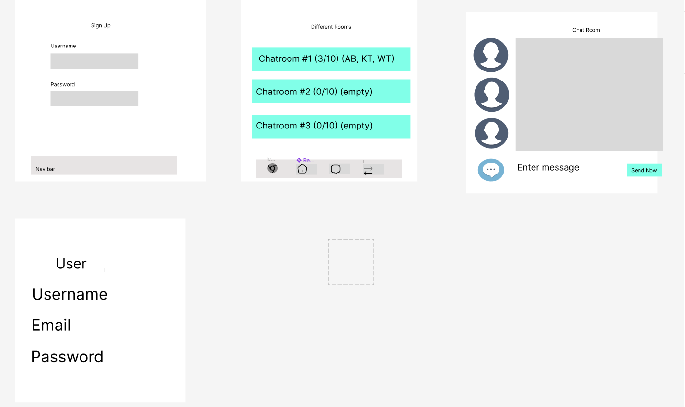

# A real-time ChatApp
This project is about building real-time communication features for users.

### Technologies Used

* Django
* PostgreSQl
* Full CRUD
* React

## Team members
* Product Manager: Winston Tang
* Repo Owner: An Bui
* Frontend Lead: An Bui
* Backend Lead: Kevin Tran

## repo
#### Backend: [https://github.com/anbee123/chatapp-backend-.git](https://github.com/anbee123/chatapp-backend-.git)
#### Frontend:[https://github.com/anbee123/chatapp-frontend.git](https://github.com/anbee123/chatapp-frontend.git)

## Wireframe and Models

## how to use the app

* As a user, you should be able to log-in in to the app
* Add after succesfully logged in, choose a room to chat
 
 ## Model ERD
 

 ## Bonus 
 * Websocket API
 * Alows open two-way communication session